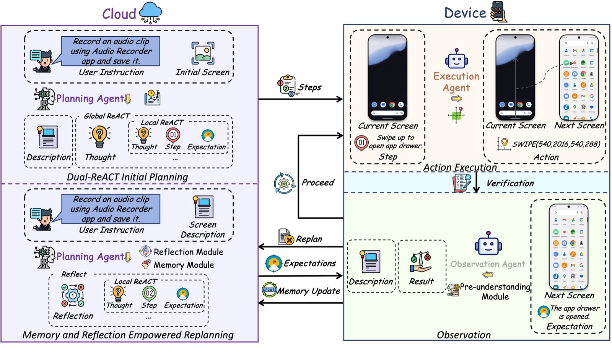

We are happy to share that **EcoAgent** has been accepted to **AAAI 2026**.

Mobile agents built on (M)LLMs are getting good at planning, but most still live entirely in the cloud. That works — until you count **screenshots uploaded for verification, MLLM tokens per step, and end-to-end latency**. A typical cloud multi-agent loop spends seconds round-tripping pixels just to decide whether the last tap landed.

EcoAgent puts that loop back in its place: keep heavy reasoning in the cloud, push perception and verification to the device, and **close the loop** so the cloud actually hears back when something goes wrong.

## Three agents, one feedback loop

EcoAgent splits work across three specialized agents:

- **Cloud-based Planning Agent** — a powerful MLLM that decomposes the user instruction into steps and replans when execution fails.
- **Device-based Execution Agent** — a fine-tuned multimodal SLM (ShowUI 2B or OS-Atlas-Pro 4B) that grounds and executes one step on the current screen.
- **Device-based Observation Agent** — a lightweight MSLM (Qwen2-VL-2B) that verifies the result and reports back to the cloud.

Most prior device-cloud agents stream cloud → device and stop there. EcoAgent adds device → cloud feedback so the Planning Agent can reflect on what actually happened and replan, instead of issuing instructions into the void.

## Two ideas that make the loop affordable

**Dual-ReACT planning.** The Planning Agent does ReACT at two levels: a global pass decomposes the instruction into subgoals, then a local pass emits each concrete step `STᵢ` together with an explicit **expectation** `EXᵢ` describing what the post-action screen should look like. Expectations are the contract the device can verify locally — no need to round-trip a screenshot to ask "did this work?"

**Pre-Understanding Module.** When the device does need to report context back (on failure, for replanning), the Observation Agent encodes the screen into a compact textual representation instead of shipping the image. Raw mobile screens cost an MLLM about **1400 tokens per image**; the textual summary is **50–150 tokens** — a 10–30× drop in device-to-cloud traffic, and the user's pixels stay on device.

## Results on AndroidWorld

We evaluate on **AndroidWorld** (Rawles et al. 2024), a programmatic Android benchmark with 116 tasks across 20 real apps.

| Agent | Architecture | SR (%) | MLLM tokens / task | Latency (s) |
| --- | --- | :-: | :-: | :-: |
| AppAgent (GPT-4o) | Cloud single | 11.2 | 15,309 | 7.1 |
| **M3A (GPT-4o × 2)** | Cloud multi | **28.4** | 87,469 | 15.3 |
| UGround-V1-2B (+ GPT-4o × 2) | Open-loop device-cloud | 32.8 | 45,192 | 18.2 |
| **EcoAgent (OS-Atlas)** | **Closed-loop device-cloud** | **27.6** | **3,240** | — |
| **EcoAgent (ShowUI)** | **Closed-loop device-cloud** | **25.6** | 3,545 | **3.9** |

EcoAgent (OS-Atlas) reaches **27.6% SR**, essentially matching **M3A's 28.4%** which uses two GPT-4o instances. The closed-loop design is where the savings show up: **96% fewer MLLM tokens** than M3A, and per-step latency drops from **15.3s to 3.9s** — a 4× speedup driven mostly by not shipping screenshots back after every action.

## Takeaway

EcoAgent is a design point, not a final answer:

- **Closed-loop ≠ chatty-loop.** The device → cloud channel is short text, not screenshots, so feedback is cheap enough to use every step.
- **Specialization beats one big model.** Splitting Planning / Execution / Observation across three differently-shaped agents costs less and performs as well as a dual-cloud GPT-4o stack on AndroidWorld.
- **Orthogonal to better device models.** Plug a stronger on-device grounder into the Execution Agent slot and EcoAgent's planning and feedback machinery still applies.

If you work on mobile agents, on-device LLMs, or device-cloud systems, we'd love to compare notes.

## Further reading

- Paper (extended): [arXiv:2505.05440](https://arxiv.org/abs/2505.05440)
- Code: [github.com/Yi-Biao/EcoAgent](https://github.com/Yi-Biao/EcoAgent)
- Benchmark: [AndroidWorld](https://github.com/google-research/android_world)
